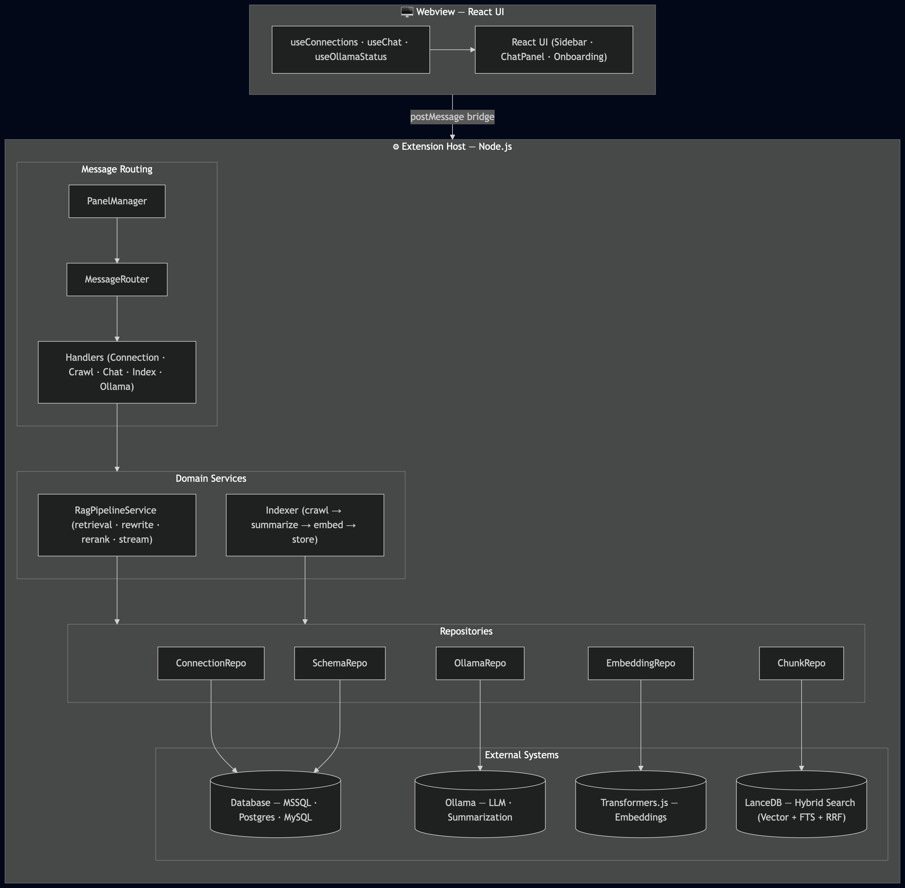
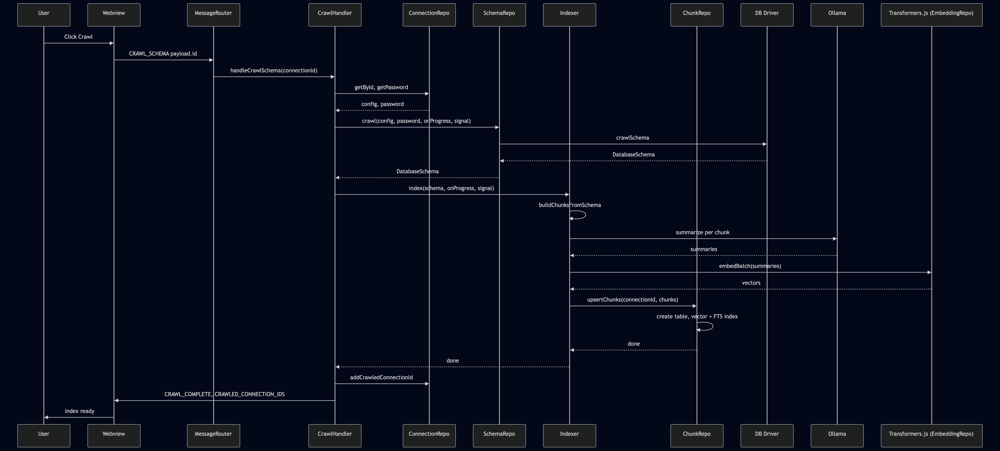
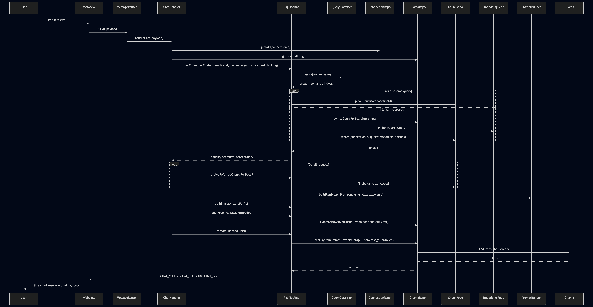

# SchemaSight

**Chat with your database. Locally.**

*Understand any database, instantly — local AI, no cloud, no data leaves your machine.*

SchemaSight is a VS Code extension for developers who need to make sense of unfamiliar or legacy databases. Connect to SQL Server, PostgreSQL, or MySQL, index schema objects locally, and ask grounded questions about tables, views, stored procedures, functions, and business logic without leaving your editor.

[](https://opensource.org/licenses/MIT)
[](https://code.visualstudio.com/)
[](https://ollama.ai)
[](https://marketplace.visualstudio.com/items?itemName=your-publisher.schemasight)

## Why SchemaSight

Developers lose hours reading database schemas, stored procedures, and scattered business logic just to answer questions like:

- What does this procedure do?
- Where is row-level security applied?
- What tables are involved in invoicing?
- What is this database about?

SchemaSight helps you answer those questions from the indexed schema itself, with local retrieval and local LLM generation.

## What It Is

- A local-first database comprehension copilot for VS Code
- Built for schema exploration and stored-code understanding
- Best for onboarding, maintenance, audits, and legacy-database discovery

## What It Is Not

- Not a live SQL execution tool
- Not a row-level data exploration or BI tool
- Not a database performance tuning or query-plan analyzer

## Supported Databases

- SQL Server
- PostgreSQL
- MySQL

## Core Features

- Add and manage database connections in the VS Code sidebar
- Guided onboarding flow with Ollama verification, model pull, and schema crawl in one place
- Change your chat model at any time via the model settings panel — pull and re-index without leaving VS Code
- Crawl and index tables, views, stored procedures, and functions
- Use local embeddings and local Ollama models for grounded Q&A
- Ask follow-up questions like “can you explain it?” with object resolution
- Inspect how answers were produced through context and retrieval visibility
- View index status and quality details for each connection

## Local-First By Design

SchemaSight is designed for teams that cannot or do not want schema understanding workflows to depend on a cloud service.

- Retrieval and answer generation run on your machine via Ollama
- Embeddings run locally via Transformers.js (all-MiniLM-L6-v2) — no external embedding API required
- Credentials are stored using VS Code secret storage
- The extension works from schema metadata and object definitions, not uploaded app code

## Screenshot

### Onboarding


### Chat


## Quick Start

### For users

1. Install and start [Ollama](https://ollama.ai/).
2. Open SchemaSight from the VS Code sidebar or run `SchemaSight: Open Panel`.
3. Add a database connection.
4. Follow the onboarding flow — verify Ollama, pull your model, and crawl the schema 
   all from within the extension.
   > **Note:** Initial indexing summarizes every schema object using a local LLM.
   > On an Apple M5 16GB with ~95 objects, this takes approximately 15–20 minutes.
   > Older hardware will take longer. This is a one-time cost — re-indexing is only
   > needed when your schema changes or you switch models.
5. Ask questions in plain English about your schema, tables, stored procedures, and 
   business logic.

### Example questions

- What is this database about?
- What tables are related to orders?
- Is there logic to remove row-level security?
- Explain `example_store_procedure` in detail.
- What does this stored procedure update?

## Architecture Overview

SchemaSight uses a **layered architecture** with clear separation of concerns:

| Layer | Role | Key components | Location |
|-------|------|----------------|----------|
| **Presentation** | React webview UI; sends and receives typed messages over the VS Code postMessage bridge | App, Sidebar, ChatPanel, useConnections / useChat / useOllamaStatus, vscodeApi | `src/webview/` (App, components, hooks) |
| **Adapter** | Message routing and request handling; dispatches webview messages to handlers | PanelManager, MessageRouter, ConnectionHandler, CrawlHandler, ChatHandler, IndexHandler, OllamaHandler | `src/webview/MessageRouter.ts`, `src/webview/handlers/` |
| **Domain services** | Business logic: RAG pipeline (retrieval, context, summarization), indexing pipeline | RagPipelineService, Indexer | `src/services/rag/`, `src/services/indexing/` |
| **Repositories** | Data access and external APIs | ConnectionRepository, SchemaRepository, ChunkRepository, OllamaRepository, EmbeddingRepository | `src/repositories/` |
| **Infrastructure** | DB drivers, prompt building, shared types | PromptBuilder, DB drivers (Mssql, Postgres, Mysql) | `src/db/drivers/`, `src/llm/`, `src/shared/` |

The extension host uses **dependency injection**: `extension.ts` constructs repositories and services and passes a single `Services` object into `PanelManager` and then `MessageRouter`. Handlers receive only the repositories and services they need. The webview and extension communicate via a **message-based API** defined in `shared/types.ts` (no shared runtime beyond postMessage).

### System Architecture



User actions go from the webview over **postMessage** into the extension host, then down through handlers → services → repositories to external systems. The table above lists the components in each layer.

### Frontend Flow

The frontend is a single React app mounted in the panel and sidebar webview. `App.tsx` coordinates three main hooks:

- **useConnections()** — Connection list, add/remove/test, crawl status, crawled-connection ids, index stats
- **useChat()** — Per-connection chat state, streaming tokens, thinking steps, summary persistence
- **useOllamaStatus()** — Ollama availability, selected model, model-pulled state, pull progress

UI journey:

1. Add or select a connection in the sidebar
2. Ensure Ollama and model are ready
3. Crawl and index the schema (progress via `CRAWL_PROGRESS` messages)
4. Ask questions in chat; inspect “How this was answered” for retrieval and context

### Crawl And Index Flow



During indexing:

1. **ConnectionRepository** supplies config and password; **SchemaRepository** calls the appropriate DB driver and returns a **DatabaseSchema** (tables, views, procedures, functions).
2. **Indexer** builds one **SchemaChunk** per object, summarizes each with **OllamaRepository**, embeds summaries locally via **Transformers.js** (all-MiniLM-L6-v2) through **EmbeddingRepository**, then **ChunkRepository** upserts into LanceDB with vector and FTS indexes.

### Chat And RAG Flow



At a high level:

1. **ChatHandler** resolves connection and context limit, then delegates retrieval to **RagPipelineService**.
2. **RagPipelineService** calls **QueryClassifier** to classify the query as broad, semantic, or detail. For broad queries it fetches all chunks; for semantic it may rewrite the question via **OllamaRepository**, embeds the query via **EmbeddingRepository**, and runs hybrid search via **ChunkRepository**.
3. For "explain that" / detail requests, it resolves referred chunks (from context or **findByName**) and injects full definitions into the system prompt.
4. **PromptBuilder** builds the RAG system prompt; **RagPipelineService** may summarize older conversation when near the model context limit.
5. **OllamaRepository** streams the chat response; **ChatHandler** posts **CHAT_CHUNK**, **CHAT_THINKING**, and **CHAT_DONE** back to the webview.

### Why The Architecture Matters

- **Separation of concerns** — Repositories own data and external APIs; services own orchestration and rules; handlers own request/response only.
- **Testability** — Repositories and services can be unit-tested with mocks; the message contract in `shared/types.ts` is the single bridge between webview and extension.
- **Local-first** — Retrieval, embeddings, and generation stay on the machine; credentials in VS Code SecretStorage.
- **Transparency** — "How this was answered" is backed by real pipeline stages (search, context, model) exposed via **CHAT_THINKING**.

## Trust And Boundaries

SchemaSight aims to be useful and transparent, but it should be treated like an assistant for understanding database structure and logic, not as an authoritative execution engine.

- It answers from retrieved schema context and object definitions
- It works best when the relevant tables, procedures, or functions are present in the index
- Broad architectural answers are inferred from indexed object names and summaries
- Changing the Ollama model requires re-indexing for consistent results

## Installation

### From Marketplace

Install `SchemaSight` from the VS Code Marketplace when published.

### From source

```bash
npm install
npm run build
```

Then open the repo in VS Code and press `F5` to launch the Extension Development Host.

## Model Notes

- Recommended model: `llama3.1:8b`
- Smaller models may index faster but can reduce answer quality
- `llama3.1:8b` may struggle to summarize stored procedures exceeding ~20,000 characters. If your database has large, complex procedures, consider a stronger model such as `llama3.1:70b` or `qwen2.5:32b` for better indexing quality
- To change your model after onboarding, use the model settings option in the 
  panel — pull the new model and re-index your connection for changes to take effect.
  
## Development

Project structure:

| Path | Role |
|------|------|
| `src/extension.ts` | Extension entry point; constructs repositories and services, passes `Services` into PanelManager |
| `src/commands/` | VS Code command registration (e.g. open panel) |
| `src/repositories/` | Data access: ConnectionRepository, SchemaRepository, ChunkRepository, OllamaRepository, EmbeddingRepository |
| `src/services/rag/` | RAG pipeline: RagPipelineService, QueryClassifier, QueryParser, ContextBudget |
| `src/services/indexing/` | Indexing pipeline: Indexer (schema → chunks → summarize → embed → store) |
| `src/db/drivers/` | DB drivers (Mssql, Postgres, Mysql); used by ConnectionRepository and SchemaRepository |
| `src/llm/` | PromptBuilder (prompts for summarization, query rewrite, RAG system prompt) |
| `src/shared/` | Shared types (message contract, DbConnectionConfig, SchemaChunk, etc.) |
| `src/webview/` | PanelManager, MessageRouter, handlers (application layer); React UI (components, hooks), vscodeApi bridge |
| `src/utils/` | Logger and other utilities |

## License

MIT — see [LICENSE](LICENSE) for details.